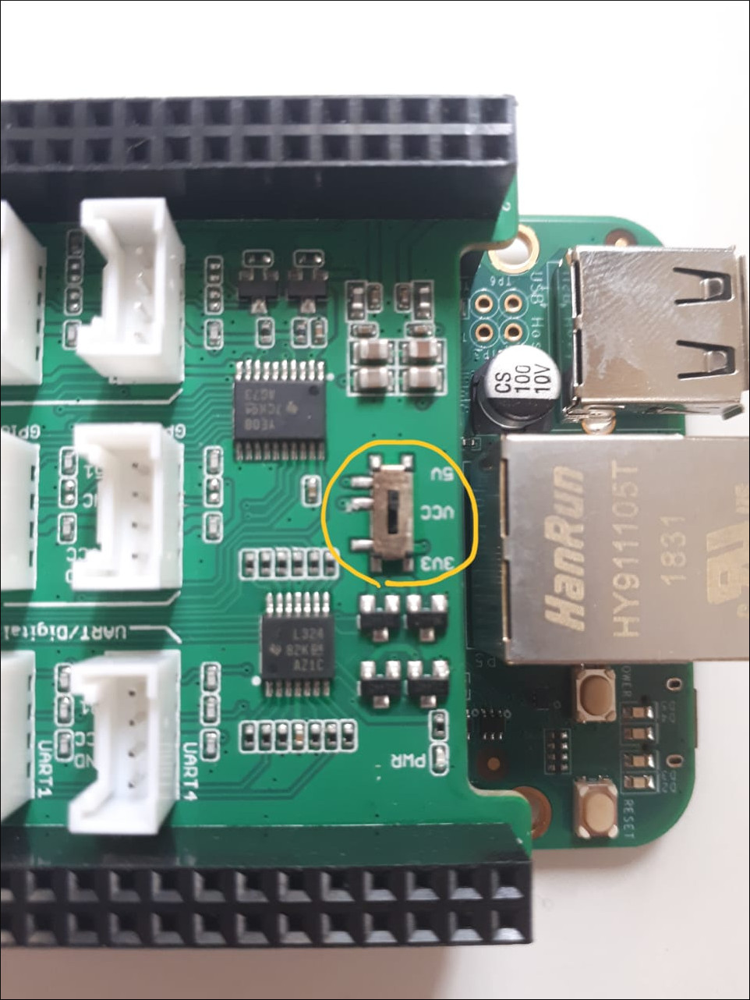

# Beaglebone Green Roadtest

## Overview
The Beaglebone Green is compatible with the Beaglebone Black. This means that it can benefit from the existing online resources, documentation and community support for Beaglebone black. The only difference is that the HDMI connector has been replaced by two “Grove ports” and the 5V DC barrel jack has been removed. Apart from these hardware changes for lowering the price, the addition of Grove ports is a nice feature that enables interfacing with a large set of components from the Grove ecosystem.

This makes it ideal for headless embedded projects, where an HDMI display is not required. It is also very easy to connect and access the Beaglebone Green over the USB ethernet and serial console out of the box. The default interface is a web based HTTP server, accessible over USB ethernet. It has a nice collection of documentation, libraries and demo snippets and can be used to quickly write programs to control the LEDs and other hardware.

The default programming environment is based on the Javascript based "Bonescript" library and Cloud9 IDE which allows writing programs in Javascript and Python using a web interface. However, having a background in low-level embedded software engineering, I prefer no abstraction and having the full control of the system. So my preferred interface is the commandline terminal of the Beaglebone Green and working with the shell directly. The terminal can be accessed in two ways after the target boots up; 1) by SSH'ing to the address 192.168.7.2 or 2) by connecting to the USB-serial port /dev/ttyACMO using a terminal emulator software.

## The Roadtest
For this Roadtest, I will be exploring the Beaglebone Green, as a platform for a more serious real world embedded application. With plenty of GPIOs and on-board PRUs, the Beaglebone platform has always been very well suited for robotics and motor control applications. The addition of Grove ports allows access to the Grove modules ecosystem, which contains a large set of sensors, actuators and various other electronic modules.

The end goal is to develop a Beaglebone Green based platform for controlling a 12-DOF Hexabot robot. The robot has been developed by one of my ex-colleagues and is using Arduino core running on ESP-WROOM-32 micocontroller. It has a 3D-printed body with 6 legs and each leg has 2 servo motor joints. The decision to replace it with Beaglebone Green is based on two premises, first I want to use ROS to control the robot and add advanced functionality and secondly, controlling and generating the gait patterns for all six legs requires the precise and synchronized timing of control signals, where I think PRU would come in handy. The ability to use Grove modules would also make it easier for adding additional hardware modules.

Below is the image of the hexabot robot in it's current state for reference.


I will try to roadtest the Beaglebone Green by considering the use-case of developing a platform for Robotics development. As such, I will be testing on following aspects:

1. Powering up the Beaglebone Green
2. Connection between development host and Beaglebone Green
3. Connecting the sensors (Grove system)
4. Enabling and using Beaglebone capes
5. Controlling the actuators
6. ROS
7. Real time capability

## 1. Powering up the board
The robot needs to operate from the battery. Morever, not all projects can be tethered to a PC by a USB cable. Therefore, I tried to explore powering the Beaglebone Green by other sources. Unfortunately, with the absence of 5V DC Jack and lack of documentation, it is bit tricky. For instance, the Beaglebone Green mentions that the board can be powered from two sources;

1. The micro USB port.
2. VDD_5V (Pins 5 and 6 of P9 header)

Further more, it says that the USB port has been limited to max 500mA of current, and this limit can be increased by changing the setting of TPS65217C Power Management IC (PMIC), but the details are not mentioned regarding how to do so. It also says that if a cape or power hungry device is plugged in to the board, then more current could be derived from the VDD_5V pin, but it also fails to mention the current limit on VDD_5V pin. Overall, I found the power section of the Beaglebone Green SRM to be very limited and incomplete, as compared to the Beaglebone Black's SRM, which describes the power pins and their current limits in more detail.

For instance, I could find out the current limits of power pins in the Beaglebone Black SRM. According to it, each VDD_5V pin can handle maximum 1A current while each SYS_5V pin (P9 pins 7 & 8) can handle 250mA max. Since the power circuit of both boards is same, I take that these limits are the same for Beaglebone Green as well.

For most users, these details might be irrelevant, but still it is better to be aware of these limits if someone is designing a custom cape or using too much power. In the absence of 5V DC Jack, the only way to reach the higher current VDD_5V pins is through P9 extension header, which is not very convenient and safe per se.

Finally, the PMIC on Beaglebone Green can support Lithium battery based operation, including the battery charging. Infact, there are some unpopulated pins on both Beaglebone Black and Green boards, that can be used for direct Lithium battery based operation but I couldn't find any official word on it. There are certain [hacks available for powering the beaglebone black directly from Lithium battery](https://www.element14.com/community/community/designcenter/single-board-computers/next-gen_beaglebone//blog/2013/08/10/bbb--rechargeable-on-board-battery-system) but I am not sure how safe or relevant it is to Beaglebone Green. I will experiment more on this in future.

For my project, I decided to power the board from micro USB port. For that, I ordered a [USB Micro-B DIY connector shell from Adafruit](https://www.adafruit.com/product/1390) to create a custom USB cable for powering the beaglebone green from Lithium battery over the micro USB connector.


I decided to use 4 18650 3000mAh Lithium-ion batteries, in 2 series 2 parallel configuration for a total of 7.4 volts 6000mAh capacity for powering the board and servos. I prototyped a LM2596 switching regulator based power distribution circuit to generate 5V for board and servos. Each regulator can output max 3A of current.


And here's the image of final power section.


And here is the complete test setup.


### 1.1 Boot time
When the Beaglebone Green was powered by connecting to my host PC using the USB cable, I noticed a significant boot delay, from when the POWER and STATUS LEDs started blinking up to when the board was accessible over USB.

In order to get a rough estimate of this boot delay, I decided to measure the time from when it is powered up to it's detection as a USB device. I executed the below command after plugging in the Beaglebone Green and started watching the USB bus for device detection. As soon the device was detected, I killed the command and noted the time measured. I tried it 3 times and the average boot time comes out to be 51 seconds, which is surprisingly high.

Unfortunately, the console over USB is not available till the Beaglebone is detected as a USB device. Therefore, there is no way of seeing what happens during the boot. My guess is that it might be waiting for Ethernet connection during boot and since the Ethernet cable is not plugged in, the delay must be due to a time out.

Anyways, there is a significant delay till the Beaglebone Green is accessible after powering up over USB.   
```bash
test@HardwareTestPC:~$ # lsusb output before Beaglebone Green plugged in
test@HardwareTestPC:~$ lsusb
Bus 002 Device 001: ID 1d6b:0003 Linux Foundation 3.0 root hub
Bus 001 Device 007: ID 04f2:b541 Chicony Electronics Co., Ltd
Bus 001 Device 006: ID 8087:0a2b Intel Corp.
Bus 001 Device 019: ID 046d:c077 Logitech, Inc. M105 Optical Mouse
Bus 001 Device 020: ID 154b:6000 PNY
Bus 001 Device 001: ID 1d6b:0002 Linux Foundation 2.0 root hub

test@HardwareTestPC:~$ # lsusb output after Beaglebone Green detected
test@HardwareTestPC:~$ lsusb
Bus 002 Device 001: ID 1d6b:0003 Linux Foundation 3.0 root hub
Bus 001 Device 007: ID 04f2:b541 Chicony Electronics Co., Ltd
Bus 001 Device 006: ID 8087:0a2b Intel Corp.
Bus 001 Device 019: ID 046d:c077 Logitech, Inc. M105 Optical Mouse
Bus 001 Device 024: ID 1d6b:0104 Linux Foundation Multifunction Composite Gadget
Bus 001 Device 020: ID 154b:6000 PNY
Bus 001 Device 001: ID 1d6b:0002 Linux Foundation 2.0 root hub

test@HardwareTestPC:~$ # Beaglebone Green USB ID is 1d6b:0104

test@HardwareTestPC:~$ # command for watching the USB bus for detection
test@HardwareTestPC:~$  time watch -n 1 lsusb
real	0m51.350s
user	0m2.661s
sys	0m0.213s
```

## 2. Connection between development host and Beaglebone Green
For robotics based development, it's a common use-case to cross-compile the software on the development host PC and then transfer the generated binaries to the target device. This is because the development on host PC is much faster than on the resource constrained embedded device.

The Beaglebone Green when connected to host over USB, creates a USB ethernet connection. This connection can be used to communicate between host and Beaglebone just like a normal ethernet connection. Morever, the internet connection of the host can also be shared with the Beaglebone, making it easier to install packages.

### 2.1 Sharing the internet over USB Ethernet
On host pc, find out the USB ethernet interface of the Beaglebone Green. It will be the interface with IP address *192.168.7.1*. Note down the name of this interface *enx3403de6337b1* as it will be used to setup IP packet forwarding to enable internet access. Also note down the host interface connected to the internet which is wlp1s0 in this case.
```bash
test@HardwareTestPC:~$ ifconfig
enp0s31f6: flags=4099<UP,BROADCAST,MULTICAST>  mtu 1500
        ether 50:7b:9d:6d:4a:01  txqueuelen 1000  (Ethernet)
        RX packets 0  bytes 0 (0.0 B)
        RX errors 0  dropped 0  overruns 0  frame 0
        TX packets 0  bytes 0 (0.0 B)
        TX errors 0  dropped 0 overruns 0  carrier 0  collisions 0
        device interrupt 16  memory 0xe1300000-e1320000  

enx3403de6337b1: flags=4163<UP,BROADCAST,RUNNING,MULTICAST>  mtu 1500
        inet 192.168.7.1  netmask 255.255.255.252  broadcast 192.168.7.3
        inet6 fe80::8df7:68f:45cd:e572  prefixlen 64  scopeid 0x20<link>
        ether 34:03:de:63:37:b1  txqueuelen 1000  (Ethernet)
        RX packets 88  bytes 18031 (18.0 KB)
        RX errors 0  dropped 0  overruns 0  frame 0
        TX packets 78  bytes 21737 (21.7 KB)
        TX errors 0  dropped 0 overruns 0  carrier 0  collisions 0

...
wlp1s0: flags=4163<UP,BROADCAST,RUNNING,MULTICAST>  mtu 1500
        inet 192.168.128.56  netmask 255.255.255.0  broadcast 192.168.128.255
        inet6 fe80::2ba2:3c21:e423:b52  prefixlen 64  scopeid 0x20<link>
        ether a4:34:d9:27:b2:44  txqueuelen 1000  (Ethernet)
        RX packets 2528488  bytes 3031876355 (3.0 GB)
        RX errors 0  dropped 0  overruns 0  frame 0
        TX packets 1328091  bytes 1268728518 (1.2 GB)
        TX errors 0  dropped 0 overruns 0  carrier 0  collisions 0
```
Enable the IP network forwarding for the incoming packets on Beaglebone Green USB ethernet interface by typing below commands on host.
``` bash
test@HardwareTestPC:~$ sudo iptables --table nat --append POSTROUTING --out-interface wlp1s0 -j MASQUERADE
test@HardwareTestPC:~$ sudo iptables --append FORWARD --in-interface enx3403de6337b1 -j ACCEPT
test@HardwareTestPC:~$ sudo sh -c "echo 1 > /proc/sys/net/ipv4/ip_forward"
```

On Beaglebone Green, type below commands to start using the host's internet connection.
```bash
debian@beaglebone:~$ sudo route add default gw 192.168.7.1
debian@beaglebone:~$ sudo sh -c " echo nameserver 8.8.8.8 >> /etc/resolv.conf"
debian@beaglebone:~$ # Verify that internet is accessible by pinging to a known server
debian@beaglebone:~$ ping www.google.com
PING www.google.com (216.58.200.68) 56(84) bytes of data.
64 bytes from hkg07s30-in-f4.1e100.net (216.58.200.68): icmp_seq=1 ttl=54 time=5.66 ms
64 bytes from hkg07s30-in-f4.1e100.net (216.58.200.68): icmp_seq=2 ttl=54 time=6.13 ms
64 bytes from hkg07s30-in-f4.1e100.net (216.58.200.68): icmp_seq=3 ttl=54 time=5.82 ms
64 bytes from hkg07s30-in-f4.1e100.net (216.58.200.68): icmp_seq=4 ttl=54 time=4.79 ms
^C
--- www.google.com ping statistics ---
4 packets transmitted, 4 received, 0% packet loss, time 3005ms
rtt min/avg/max/mdev = 4.794/5.605/6.137/0.501 ms
```

## 3. Connecting the sensors - Grove system
Before going further, I would like to have just a quick word on Grove system. It is a prototyping system, similar to Beaglonebone capes, that uses a standardized wire connector for interfacing with a large set of Grove modules. This is supposed to make prototyping easier and flexible. For more details and list of available Grove modules, you can visit [the seeedstudio website](http://wiki.seeedstudio.com/Grove/).

**At this point, it is worth mentioning that although all Grove modules have the same Grove connector, it can have different types of electrical signals.** The Grove ports come in below four types:

1. Analog Grove port
2. Digital Grove port
3. UART Grove port
4. I2C Grove port

The analog Grove port connects to the ADC pins on the Beaglebone chip.

The digial Grove ports connects to the GPIO pins.

And finally the UART and I2C Groove ports connect to the UART and I2C pins of the Beaglebone chip respectively.

Therefore while selecting Grove modules, care must be taken to make sure the correct Grove connector type is used.

**The Beaglebone Green main board has only I2C and UART Grove ports, hence it cannot interface with the digital and analog Grove modules.**

Below is the snapshot of [online shop for Grove modules](https://www.seeedstudio.com/category/Grove-c-1003.html) which has a nice collection of Grove modules, sufficient to serve most of the requirements.


## 4. Enabling and using Beaglebone capes
Admittedly it has been a while since I have worked with Beaglebone. The last time I worked with Beaglebone Black, it was running Linux kernel version 3.8 and had a Capemanager mechanism to load the device tree overlays to enable and configure capes. The kernel version on Beaglebone Green is 4.9, and a lot has changed regarding how capes are handled, which we will see shortly.

### 4.1 Grove base cape
The Beaglebone Grove base cape forms the base shield, to which other Grove modules can be easily attached. It provides multiple Grove ports, and can be used to attach all types of available Grove modules.


The Grove base cape has 6 digital Grove ports (2 of them can be used as UARTs), 2 analog Grove ports and 4 I2C Grove ports. The base cape also contains a 32KB EEPROM which is originally intended to store the cape specific information for Capemanager and it is also possible to disable the write protect of the EEPROM, by shorting a jumper on board, and use it to store custom data.

In addition, it also has a 3.3 – 5V voltage level selection switch, which allows to set the output voltage levels on the base cape Grove ports. Now there is common concern that voltage should not be applied to any Beaglebone I/O pins before the board itself is powered up. It is mentioned in the section "5.15 Expansion Board External Power" of the BBG SRM. Therefore, this voltage switch also acts to protect the Beaglebone pins by making sure no voltage is applied before full power up.

The following figure shows the voltage level conversion schematics.


The VDD_G level in above schematics can be selected between 3.3 or 5V using a slider switch on the base cape.



In addition to base cape, I also ordered the Grove I2C hub, which allows connecting 3 additional I2C devices to a single I2C port and although the base cape itself was sufficient to meet all of my interfacing requirements, I thought it might come in handly if I want to add more Grove modules in future.


### 4.2 Using the Grove base cape in Linux
#### 4.2.1 The deprecated Capemanager interface
As mentioned earlier, I was expecting the familiar Beaglebone Capemanager interface to load the device tree overlay for the Grove base cape. I tried dumping the contents of the Grove base cape EEPROM to find the part number and revision, which is supposed to load the correct device tree overlay fragment (dtbo) for the Grove base cape.

```bash
debian@beaglebone:~$ sudo cat /sys/bus/i2c/devices/2-0054/eeprom | hexdump -C
[sudo] password for debian:
00000000  aa 55 33 ee 41 31 47 72  6f 76 65 20 42 61 73 65  |.U3.A1Grove Base|
00000010  20 43 61 70 65 20 66 6f  72 20 42 65 61 67 6c 65  | Cape for Beagle|
00000020  42 6f 6e 65 00 00 30 30  41 32 53 65 65 65 64 73  |Bone..00A2Seeeds|
00000030  74 75 64 69 6f 00 00 00  00 00 42 42 2d 47 52 45  |tudio.....BB-GRE|
00000040  45 4e 2d 47 52 4f 56 45  00 00 00 00 30 30 31 30  |EN-GROVE....0010|
00000050  33 30 33 30 30 33 35 00  ff ff ff ff ff ff ff ff  |3030035.........|
00000060  ff ff ff ff ff ff ff ff  ff ff ff ff ff ff ff ff  |................|
*
00008000
```
I was expecting to find the dtbo file named *BB-GREEN-GROVE-00A2.dtbo* under the */lib/firmware* directory but it was not there.

I tried to access the usual slots sysfs interface file */sys/devices/platform/bone_capemgr/slots* but this file was absent as well.

There is a lot of outdated information on this which becomes very confusing. Finally I came across this [useful link explaining a new overlay mechanism](https://elinux.org/Beagleboard:BeagleBoneBlack_Debian#U-Boot_Overlays) which clarified that the old slots based mechanism for loading cape device tree overlays has been deprecated now.

From kernel version 4.4 onwards, the preferred method to load the cape device tree overlays is via u-boot.

Better yet, there is a new mechanism for configuring the each Beaglebone pin directly from shell, without loading any device tree fragment.

This new feature is called the [Beaglebone Universal I/O](https://github.com/cdsteinkuehler/beaglebone-universal-io). This is enabled by default and what it does is export all the unused GPIO pins and configure them into a default input mode.

#### 4.2.2 Using the new Beaglebone Universal I/O
Before using the Beaglebone Universal I/O mechanism, it is worth mentioning that it works on the Beaglebone pin addressing scheme.

On Beaglebone, the pins are referenced by their P8/P9 header name and position. For example, GPIO pin 115 is referenced as P9_27.

For a complete reference on pin naming schemes and other details, these documents prepared by Derek Molloy are the most comprehensive resources.

[P8 header reference](https://github.com/derekmolloy/boneDeviceTree/blob/master/docs/BeagleboneBlackP8HeaderTable.pdf)

[P9 header reference](https://github.com/derekmolloy/boneDeviceTree/blob/master/docs/BeagleboneBlackP9HeaderTable.pdf)

The list of pins available on the Grove base cape is given below:
* GPIO_15 / UART1_TXD
* GPIO_14 / UART1_RXD
* GPIO_30 / UART4_RXD
* GPIO_31 / UART4_TXD
* GPIO_115
* GPIO_117
* GPIO_50
* GPIO_51

To find the current status of the  pins, we can use the config-pin utility but in order to use it, we need to find a mapping between Beaglebone pin number and the GPIO pin number. In addition to above mentioned references, this mapping can also be found by reading the following file:

``` bash
debian@beaglebone:~$ cat /sys/devices/platform/ocp/ocp\:cape-universal/status
 ...
 8 P9_27                    115 IN  0
 9 P9_26                     14 IN  0
10 P9_25                    117 IN  0
11 P9_24                     15 IN  0
17 P9_16                     51 IN  0
19 P9_14                     50 IN  0
20 P9_13                     31 IN  0
22 P9_11                     30 IN  0
...
```
Once we know the beaglebone pin number for the GPIO pin, we can find its configuration. For instance, the pin number for GPIO 115 is P9_27. Its status can be found as below:

```bash
debian@beaglebone:~$ config-pin -q P9_27
P9_27 Mode: default Direction: in Value: 0
```
The above output shows that GPIO 115 has been configured as input and is in the default state.

Currently, the default state for all pins is gpio with pull-up/down resistor set to the reset default value, but this could change. This is same for all other pins.

### 4.3 Testing the base cape UART pins
The UART4 pins (GPIO_30 & GPIO_31) can be configured as below to set them in UART mode:
```bash
debian@beaglebone:~$ # List the available pin modes
debian@beaglebone:~$ config-pin -l P9_11
default gpio gpio_pu gpio_pd gpio_input uart
debian@beaglebone:~$ config-pin -l P9_13
default gpio gpio_pu gpio_pd gpio_input uart
debian@beaglebone:~$ # Set the UART mode
debian@beaglebone:~$ config-pin P9_11 uart
debian@beaglebone:~$ config-pin P9_13 uart
debian@beaglebone:~$ # Verify the UART mode is set
debian@beaglebone:~$ config-pin -q P9_11
P9_11 Mode: uart
debian@beaglebone:~$ config-pin -q P9_13
P9_13 Mode: uart
```

Short the pins 11 and 13 of P9 header so that Beaglebone can talk to itself in a loopback mode. Whatever is sent on TX pin is received by the RX pin.


Disable the serial getty service running on UART4 port. This service is responsible for showing the login prompt if a connection is made on UART4. In my experience, it might interfere with manual UART4 testing so it is better to disable it so that it doesn't try to access UART4. But first we need to find the tty* device file that corresponds to UART4. From the online documentation, I could easily find that it is /dev/ttyO4. However, there is another method of find this out from the boot logs iteself. After the Beaglebone has booted, run the below command to list down the detected UART ports.

```bash
debian@beaglebone:~$ dmesg | grep tty
[    0.000000] Kernel command line: console=ttyO0,115200n8 bone_capemgr.uboot_capemgr_enabled=1 root=/dev/mmcblk1p1 ro rootfstype=ext4 rootwait uboot_detected_capes=BB-GREEN-GROVE, coherent_pool=1M net.ifnames=0 quiet
[    0.003255] WARNING: Your 'console=ttyO0' has been replaced by 'ttyS0'
[    1.515339] 44e09000.serial: ttyS0 at MMIO 0x44e09000 (irq = 158, base_baud = 3000000) is a 8250
[    1.528266] console [ttyS0] enabled
[    1.529288] 48022000.serial: ttyS1 at MMIO 0x48022000 (irq = 159, base_baud = 3000000) is a 8250
[    1.530150] 48024000.serial: ttyS2 at MMIO 0x48024000 (irq = 160, base_baud = 3000000) is a 8250
[    1.530982] 481a8000.serial: ttyS4 at MMIO 0x481a8000 (irq = 161, base_baud = 3000000) is a 8250
[    1.531827] 481aa000.serial: ttyS5 at MMIO 0x481aa000 (irq = 162, base_baud = 3000000) is a 8250
```
Consulting the *"Memory Map"* section of AM335x TRM, I found that the UARt4 base register is 481a8000. Hence, */dev/ttyS4* corresponds to UART4. I found this out later, after I had used */dev/ttyO4* for UART4 testing but I have verified and the commands works the same if */dev/ttyS4* is used instead of */dev/ttyO4*.


Disable the serial getty running service on UART4 port

```bash
debian@beaglebone:~$ sudo systemctl disable serial-getty@ttyO4

```
Configure the serial port.
```bash
debian@beaglebone:~$ # configure the serial port
debian@beaglebone:~$ stty -F /dev/ttyO4 115200 cs8 -cstopb -parenb
```
In one terminal, start reading the UART4 device file while in other, start writing to the UART4 device file.
```bash
debian@beaglebone:~$ # Read the serial port in one terminal
debian@beaglebone:~$ cat /dev/ttyO4

debian@beaglebone:~$ # In other terminal, write to UART4
debian@beaglebone:~$ echo "Writing to UART4 1" > /dev/ttyO4
debian@beaglebone:~$ echo "Writing to UART4 2" > /dev/ttyO4
debian@beaglebone:~$ echo "Writing to UART4 3" > /dev/ttyO4
```
The first terminal should have below output.
```bash
debian@beaglebone:~$ cat /dev/ttyO4
Writing to UART4 1
Writing to UART4 2
Writing to UART4 3
```

Soon after performing the loopback UART test, I got my hands on a USB-serial breakout board so I decided to verify communication between Beaglebone Green and my host PC.


On host PC
``` bash
sudo sh -c "echo Writing this from host > /dev/ttyUSB0 "
```
On device
``` bash
debian@beaglebone:~$ cat /dev/ttyO4
Writing this from host
```

### 4.4 Testing the base cape ADC Pins
#### 4.4.1 Beaglebone Green base cape ADC protection
Beaglebone Green has 8 channel 12-bit ADC module. The ref voltage for the ADC is set as 1.8V and ADC pins are very sensitive to over-voltage and can easily be damaged if the input voltage exceeds the safe limits.

The absolute maxium rating for the ADC pin is described as -0.5V to 2.1V in the AM335x datasheet. Therefore, in most cases, it is better to protect the ADC inputs so that inputs do not exceed maximum limits.

Below is the schematics of the ADC pin protection and interface circuit on Beaglebone Green base cape.


The analog input from the Grove ADC port goes to a voltage divider circuit, and then the scaled down voltage is fed into the non-inverting input of LMV324 op-amp, configured in the voltage follower mode with unity gain. The input voltage scaling factor comes out to be 0.359 (56k/(56k + 100k). This means that the voltage of upto 5.8V can be safely applied to the Grove ADC pins (this doesn't take into account the effect of resistance tolerances which is 1%). The negative supply voltage of the op-amp is connected to GND so ideally the negative input voltages would get clamped to 0V (I am not sure why there is still a negative side clamping diode on ADC input). The BAT54SW in the schmatics is the low forward voltage drop Schottky diode and is used to clamp the ADC input voltage to 1.8V + forward voltage drop of the diode. For an average value of 0.3V forward voltage drop, this makes the positive clamping voltage to be 2.1V, the maximum tolereable ADC input voltage level.

I still don't get the why there are 1k resistors (R6, R10) in the feedback path, as per my understanding, these resistors should be connected between the output of op-amp and Beaglebone's analog pins as the only function they seem to have is limiting the current going into the ADC pins when they are clamped. Anyways, it's been ages since I worked with op-amps at the hardware level so maybe I am missing something but still, all the ADC protection circuits I have found for Beaglebone Black has the current limiting resistor connected between the op-amp output and ADC input pins.   

#### 4.4.2 Reading the ADC pins
The sysfs based interface for reading the ADC pins is shown below:
```bash
debian@beaglebone:~$ ls -l /sys/bus/iio/devices/iio\:device0/
total 0
drwxr-xr-x 2 root root    0 Aug 11 11:42 buffer
-r--r--r-- 1 root root 4096 Aug 11 11:42 dev
-rw-r--r-- 1 root root 4096 Aug 11 11:42 in_voltage0_raw
-rw-r--r-- 1 root root 4096 Aug 11 11:42 in_voltage1_raw
-rw-r--r-- 1 root root 4096 Aug 11 11:42 in_voltage2_raw
-rw-r--r-- 1 root root 4096 Aug 11 11:42 in_voltage3_raw
-rw-r--r-- 1 root root 4096 Aug 11 11:42 in_voltage4_raw
-rw-r--r-- 1 root root 4096 Aug 11 11:42 in_voltage5_raw
-rw-r--r-- 1 root root 4096 Aug 11 11:42 in_voltage6_raw
-r--r--r-- 1 root root 4096 Aug 11 11:42 name
lrwxrwxrwx 1 root root    0 Aug 11 11:42 of_node -> ../../../../../../firmware/devicetree/base/ocp/tscadc@44e0d000/adc
drwxr-xr-x 2 root root    0 Aug 11 11:42 power
drwxr-xr-x 2 root root    0 Aug 11 11:42 scan_elements
lrwxrwxrwx 1 root root    0 Jan  1  2000 subsystem -> ../../../../../../bus/iio
-rw-r--r-- 1 root root 4096 Jan  1  2000 uevent
```
where in_voltage0_raw refers to the ADC channel 0 raw value and same goes for other 6 raw voltage files.

Just to quickly test ADC pins, I connected the VCC pin of one of the Grove ports to the pin A0 of the Grove ADC port. The results are given below:
```bash
debian@beaglebone:~$ # Connect VCC pin to A0 pin of the Grove ADC port
debian@beaglebone:~$ cat /sys/bus/iio/devices/iio\:device0/in_voltage0_raw
2756
debian@beaglebone:~$ # Remove VCC pin from A0 pin of the Grove ADC port
debian@beaglebone:~$ cat /sys/bus/iio/devices/iio\:device0/in_voltage0_raw
0
```
The above raw 12‐bit (0‐4095) ADC value can be converted to the input voltage as (2756 / 4095 * 1.8) / 0.359 = 3.374 which is accurate as the VCC is selected as 3.3V using the voltage level selector switch on the base cape. Measuring the VCC voltage using multimeter shows 3.377V.

### 4.5 Testing the base cape digital pins
For this test, I set GPIO 51 pin as output and GPIO 50 pin as input. I connected both pins using a jumper wire. Here are the results:
```bash
debian@beaglebone:~$ # Set GPIO 51 of base cape as output
debian@beaglebone:~$ config-pin P9_16 out
debian@beaglebone:~$ # verify
debian@beaglebone:~$ config-pin -q P9_16
P9_16 Mode: gpio Direction: out Value: 0
debian@beaglebone:~$ # Set GPIO 50 pin of base cape as input
debian@beaglebone:~$ config-pin P9_14 in
debian@beaglebone:~$ # verify
debian@beaglebone:~$ config-pin -q P9_14
P9_14 Mode: gpio Direction: in Value: 0
debian@beaglebone:~$ # Set the GPIO 51 pin as HIGH
debian@beaglebone:~$ config-pin P9_16 high
debian@beaglebone:~$ # Read the state of GPIO 50
debian@beaglebone:~$ config-pin -q P9_14
P9_14 Mode: gpio Direction: in Value: 1
debian@beaglebone:~$ # Set the GPIO 51 pin as LOW
debian@beaglebone:~$ config-pin P9_16 low
debian@beaglebone:~$ # Read the state of GPIO 50
debian@beaglebone:~$ config-pin -q P9_14
P9_14 Mode: gpio Direction: in Value: 0
```

## 5. Controlling the actuators
The Grove system has a separate category for actuator modules, which can be used to control various types of motors including DC and Servo motors.

### 5.1 Grove 16-channel servo controller
The hexabot has 2-DOF for each leg. In simple words, each leg consists of 2 servo joints. Thus, I needed to control 12 servo motors. I searched for a suitable Grove module in the actuator category and soon enough, I found an I2C based PCA9685 16 channel PWM driver Grove module. This will allow me to control upto 16 servos by generating maximum 16 PWM signals.


For maximum flexibility, the I2C address of the PWM driver is configurable via solderable pads on the PCB. The Grove base cape schmatics show that the I2C expansion bus is connected to the I2C2 controller. Hence, I probed the I2C bus 2 for any I2C devices using the preinstalled i2c-detect utiility on the Beagleboard green.

Below is the output of I2C devices detected. The PCA9685 is detected at the default address of 0x7F as expected.

```bash
debian@beaglebone:~$ i2cdetect -a -y -r 2
     0  1  2  3  4  5  6  7  8  9  a  b  c  d  e  f
00: -- -- -- -- -- -- -- -- -- -- -- -- -- -- -- --
10: -- -- -- -- -- -- -- -- -- -- -- -- -- -- -- --
20: -- -- -- -- -- -- -- -- -- -- -- -- -- -- -- --
30: -- -- -- -- -- -- -- -- -- -- -- -- -- -- -- --
40: -- -- -- -- -- -- -- -- -- -- -- -- -- -- -- --
50: -- -- -- -- UU UU UU UU -- -- -- -- -- -- -- --
60: -- -- -- -- -- -- -- -- -- -- -- -- -- -- -- --
70: 70 -- -- -- -- -- -- -- -- -- -- -- -- -- -- 7f
```
The PCA9685 PWM driver can be loaded by following the steps below:
```bash
debian@beaglebone:~$ # Load the pca9685 i2c kernel driver
debian@beaglebone:~$ sudo sh -c "echo pca9685 0x7f > /sys/bus/i2c/devices/i2c-2/new_device"
debian@beaglebone:~$ # Verify the pca9685 i2c kernel driver has been loaded
debian@beaglebone:~$ dmesg | tail -n 2
[   99.675826] pru-rproc 4a338000.pru1: PRU rproc node /ocp/pruss_soc_bus@4a326000/pruss@4a300000/pru@4a338000 probed successfully
[  901.164890] i2c i2c-2: new_device: Instantiated device pca9685 at 0x7f
debian@beaglebone:~$ lsmod | grep pca9685
pwm_pca9685             4383  0
debian@beaglebone:~$ # See the number of available PWM channels
debian@beaglebone:~$ cat /sys/class/pwm/pwmchip8/npwm
17
```
After loading the driver and querying the number of available PWM channels, it show 17 available PWM channels. I guess one of the channel is reserved for a global PWM channel where all 16 PWM servo signals are same (not verified). Anyways, let's see how to configure the PWM on channel 1.
```bash
debian@beaglebone:~$ # Select PWM on Channel 1
debian@beaglebone:~$ echo 0 > /sys/class/pwm/pwmchip8/export
debian@beaglebone:~$ # Configure the PWM on Channel 1
debian@beaglebone:~$ # Set time period to 20ms (50Hz) (value in nano seconds)
debian@beaglebone:~$ sudo sh -c "echo 20000000 > /sys/class/pwm/pwmchip8/pwm0/period"
debian@beaglebone:~$ # Set the 50% duty cycle (ON time in nanoseconds)
debian@beaglebone:~$ sudo sh -c "echo 10000000 > /sys/class/pwm/pwmchip8/pwm0/duty_cycle"
debian@beaglebone:~$ # Enable the PWM
debian@beaglebone:~$ sudo sh -c "echo 1 > /sys/class/pwm/pwmchip8/pwm0/enable"
```
Below is the image of PWM signal measured on channel 1. As expected, with 50% duty cycle and voltage selector switch on base cape set to 5V, the measured voltage is 2.5V.


Finally, I connected 2 continuous servos to the PWM driver. See the result below.


## 6. ROS
ROS is an integral part of the modern robotic systems. It provides a standardized
software infrastructure to develop complex robotic applications and provides the implementation of commonly desired robotic functionalities including sensor interfacing, communication, navigation, mapping and simulation etc.

### 6.1 Installing ROS on Beaglebone Green
While looking for the instructions for installing ROS on the debian distribution of Beagebone Green, I found out that currently there are three options for enabling ROS on Beaglebone:

1. Run Ubuntu distribution on Beaglebone Green and then install the compatible ROS packages.
2. Run the Angstrom distribution on Beaglebone Green and then add additional ROS packages.
3. Compile the ROS from source code, either on Beaglebone Green itself (takes longer) or using a cross-compiler running on host.

**Note: Although the ROS package has precompiled binaries for debian distribution but they don't support "*"armhf"* architecture as of now. See http://wiki.ros.org/kinetic/Installation/Debian**

The first 2 options require replacing the default debian distribution of the Beaglebone Green and it might break some existing functionality. Therefore, I decided to compile the ROS from source.

I tried cross-compiling the ROS from sources first, as it should be way faster than compiling on the Beaglebone but unfortunately, I couldn't finish the cross-compilation as some packages were broken.

Therefore, I tried to compile ROS directly on the Beaglebone itself. For compilation instructions, I have followed [a very helpful link](https://machinekoder.com/ros-with-debian-stretch-on-the-beaglebone-black-green-blue/).

Below is the output of the successful compilation of ROS Kinetic package and it took around 100 minutes for compilation only (it also took a lot of time to install required packages for compilation). I will try to make cross-compilation of ROS work on Beaglebone in future and that might warrant another separate article.

```bash
debian@beaglebone:~/ros_catkin_ws$ time sudo ./src/catkin/bin/catkin_make_isolated --install -DCMAKE_BUILD_TYPE=Release --install-space /opt/ros/kinetic
...
<== Finished processing package [51 of 51]: 'rosbag'

real	100m51.922s
user	88m5.769s
sys	10m46.704s
debian@beaglebone:~/ros_catkin_ws$
```

## 7. Real-time capabilities
ROS is not a real-time framework, though it is possible to make use of the real-time capable PRU microcontrollers on the Beaglebone SoC for any real-time application requirement.

### 7.1  Setting up the PRU
There was a time when using PRU on the Beaglebone was very complex. Now thanks to the recent developments, it's a breeze. I managed to find out [a great artcile](https://www.element14.com/community/community/designcenter/single-board-computers/next-gen_beaglebone/blog/2019/05/14/coding-for-the-beaglebone-pru-with-c-in-2019) on running the PRU on Beaglebone and was able to follow it and get PRU running well under 30 minutes. Since the link mentioned has all the information, I will only write my results.

```bash
debian@beaglebone:~$ # Place the compiled firmware in /lib/firmware
debian@beaglebone:~$ sudo mv toggle_led.out /lib/firmware/toggle_led

debian@beaglebone:~$ # Set the name of PRU1 firmware name (file in lib/firmware)
debian@beaglebone:~$ sudo sh -c "echo toggle_led > /sys/class/remoteproc/remoteproc1/firmware"

debian@beaglebone:~$ # Start the PRU1
debian@beaglebone:~$ sudo sh -c "echo start > /sys/class/remoteproc/remoteproc1/state"

debian@beaglebone:~$ # Verify that PRU1 has started
debian@beaglebone:~$ dmesg | tail -n 3
[ 2671.764918] remoteproc remoteproc1: powering up 4a334000.pru
[ 2671.767913] remoteproc remoteproc1: Booting fw image toggle_led, size 31812
[ 2671.767956] remoteproc remoteproc1: remote processor 4a334000.pru is now up
```
Unfortunately I didn't have access to oscilloscope to actually see the toggle signal generated by PRU but since I did not get any error messages, I assumed it's all good.

Still to make sure, I decided to build PRU UART example and see if I can get some data on UART1 from PRU. I built the project *PRU_Hardware_UART* from *pru-software-support-package* examples. The example source runs in the loopback mode where the UART signals are not exposed on the pins and TX data is routed internally to RX. Therefore, it is not possible to observe the UART signals in the default example project, without disabling the loopback UART mode. Therefore, I modified the example project to disable loopback mode and rebuilt it.


I attached the Beaglebone to my host PC using a USB-serial adapter, connected to the UART1 port on the base cape, and started minicom to receive data from Beaglebone's PRU.

Below are the commands for loading the UART test PRU firmware.
```bash
debian@beaglebone:~$ # config UART1 pins
debian@beaglebone:~$ config-pin -l P9_24
debian@beaglebone:~$ config-pin P9_24 pru_uart

debian@beaglebone:~$ config-pin -l P9_26
debian@beaglebone:~$ config-pin P9_26 pru_uart
debian@beaglebone:~$ # Stop the PRU1
debian@beaglebone:~$ sudo sh -c "echo stop > /sys/class/remoteproc/remoteproc1/state"

debian@beaglebone:~$ # Verify that PRU1 has stopped
debian@beaglebone:~$ dmesg | tail -n 4
[ 2671.764918] remoteproc remoteproc1: powering up 4a334000.pru
[ 2671.767913] remoteproc remoteproc1: Booting fw image toggle_led, size 31812
[ 2671.767956] remoteproc remoteproc1: remote processor 4a334000.pru is now up
[ 4849.567695] remoteproc remoteproc1: stopped remote processor 4a334000.pru

debian@beaglebone:~$ # Place the PRU UART example firmware in /lib/firmware
debian@beaglebone:~$ sudo mv PRU_Hardware_UART.out /lib/firmware/PRU_Hardware_UART

debian@beaglebone:~$ # Load the firmware name to PRU1
debian@beaglebone:~$ sudo sh -c "echo PRU_Hardware_UART > /sys/class/remoteproc/remoteproc1/firmware"

debian@beaglebone:~$ # Start the PRU
debian@beaglebone:~$ sudo sh -c "echo start > /sys/class/remoteproc/remoteproc1/state"

debian@beaglebone:~$ # Verify that PRU is up
debian@beaglebone:~$ dmesg | tail -n 6
[ 2671.767913] remoteproc remoteproc1: Booting fw image toggle_led, size 31812
[ 2671.767956] remoteproc remoteproc1: remote processor 4a334000.pru is now up
[ 4849.567695] remoteproc remoteproc1: stopped remote processor 4a334000.pru
[ 6258.333177] remoteproc remoteproc1: powering up 4a334000.pru
[ 6258.333498] remoteproc remoteproc1: Booting fw image PRU_Hardware_UART, size 32572
[ 6258.333542] remoteproc remoteproc1: remote processor 4a334000.pru is now up
```

The PRU UART firmware writes a character from the string **"Hello!"** to the UART TX, and then it waits to receive a character from host, before sending more data. It doesn't matter what the host sends back i.e. it can be any character. But the host must send something in order for the PRU firmware to proceed and send further data.

The successful execution of PRU UART example verified that the PRU development environment has been set correctly and it is now ready for PRU application development.

## Conclusion
At the end of this roadtest, I have managed to setup all the building blocks required to build a platform for ROS based robotics development on Beaglebone Green. The Beaglebone Green is essentially the same as Beaglebone Black. This can be a huge plus and also a source of great confusion, because there is too much documentation and community support available that's outdated now.

The decision to rely on Linux kernel's interfaces for controlling the hardware instead of using the Cloud9 IDE or Bonescript was done because first, I wanted to have the least abstraction and full-control over the system, and secondly, it will be easier and faster to develop ROS applications, that can access the hardware using Linux Kernel's native interfaces.

I personally found the Grove system to be very convenient. The physical connection of the connector is quite solid and there are adapter cables like Grove-connector-to-female-header cable that allows interfacing with other non-Grove components. And there is a good number of Grove components available, to meet most of the requirements of a project. However, to benefit from the whole range of Grove modules, I think the Beaglebone Green Grove base cape is a must have add-on. The Grove connectors on the Beaglebone Green board itself cannot support all of the Grove sensors and modules, specifically the ones with the digital and analog interfaces (non UART/I2C).

And their might be a little confusion about the Grove connector itself as well. Since all Grove modules have the same connector, it seems like all of the Grove modules are compatible and interoperable. However, Grove connector can have different underlying protocol so the Grove connector and Grove component should be matched carefully.

Overall, it is a good, cheaper alternative to Beaglebone Black. I would like to see some improvements in the power interface, particularly in supporting the battery powered mode out-of-the box, so that it can be deployed easily in the field or battery powered applications.

The base platform is all set for robotics related exploration.
