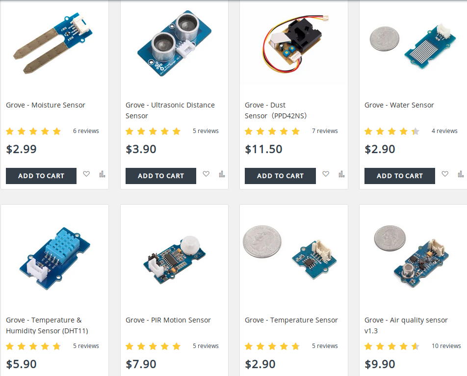
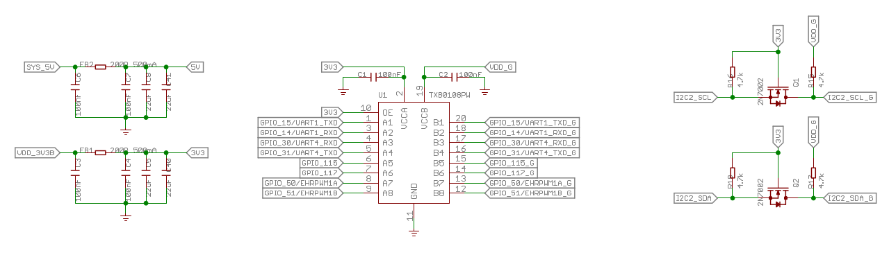

# Beaglebone Green Roadtest
### Overview
The Beaglebone Green is compatible with the Beaglebone Black. This means that it can benefit from the existing online resources, documentation and community support for Beaglebone black. The only difference is that the HDMI connector has been replaced by two “Grove ports” and the 5V DC barrel jack has been removed. Apart from these hardware changes for lowering the price, the addition of Grove ports is a nice feature that enables interfacing with a large set of components from the Grove ecosystem.

This makes it ideal for headless embedded projects, where an HDMI display is not required. It is also very easy to connect and access the Beaglebone Green over the USB ethernet and serial console out of the box. The default interface is a web based HTTP server, accessible over USB ethernet. It has a nice collection of documentation, libraries and demo snippets and can be used to quickly write programs to control the LEDs other hardware.

The default programming environment is based on the Javascript based "Bonescript" library and Cloud9 IDE which allows writing programs in Javascript and Python using a web interface. However, having a background in low-level embedded software engineering, I prefer no abstraction and having the full control of the system. So my preferred interface is the commandline terminal of the Beaglebone Green and working with the shell directly. The terminal can be accessed in two ways after the target boots up; 1) by SSH'ing to the address 192.168.7.2 or 2) by connecting to the USB-serial port /dev/ttyACMO using a terminal emulator software.

## The Roadtest
For this Roadtest, I will be exploring the Beaglebone Green, as a platform for a more serious real world embedded application. With plenty of GPIOs and on-board PRUs, the Beaglebone platform has always been very well suited for robotics and motor control applications. The addition of Grove ports allows access to the Grove modules ecosystem, which contains a large set of sensors, actuators and various other electronic modules.

The end goal is to develop a Beaglebone Green based platform for controlling a 12-DOF Hexabot robot. The robot has been developed by one of my ex-colleagues and is using Arduino core running on ESP-WROOM-32 micocontroller. It has a 3D-printed body with 6 legs and each leg has 2 servo motor joints. The decision to replace it with Beaglebone Green is based on two premises, first I want to use ROS to control the robot and add advanced functionality and secondly, controlling and generating the gait patterns for all six legs requires the precise and synchronized timing of control signals, where I think PRU would come in handy. The ability to use Grove modules would also make it easier for adding additional hardware modules.

## Boot time
To power up the Beaglebone Green, I connected it to my laptop running the Ubuntu 18.04 , by the provided USB cable. I noticed a significant delay, from when the POWER and STATUS LEDs started blinking up to when the board was accessible over USB.

To get a rough of estimate of this delay/boot time, I decided to measure the time from when it is powered up to it's detection as a USB device. I executed the below command after plugging in the Beaglebone Green and started watching the USB bus for device detection. As soon the device was detected, I killed the command and noted the time measured. I tried it 3 times and the average boot time comes out to be 51 seconds, which is surprisingly high.

Unfortunately, the console over USB is not available till the device is detected so there is no way of seeing what happens during the boot. My guess is that it might be waiting for Ethernet connection during boot and since the Ethernet cable is not plugged in, the delay must be due to a time out.

Anyways, there is a significant delay till the Beaglebone Green is accessible after powering up over USB.   
```bash
test@HardwareTestPC:~$ # lsusb output before Beaglebone Green plugged in
test@HardwareTestPC:~$ lsusb
Bus 002 Device 001: ID 1d6b:0003 Linux Foundation 3.0 root hub
Bus 001 Device 007: ID 04f2:b541 Chicony Electronics Co., Ltd
Bus 001 Device 006: ID 8087:0a2b Intel Corp.
Bus 001 Device 019: ID 046d:c077 Logitech, Inc. M105 Optical Mouse
Bus 001 Device 020: ID 154b:6000 PNY
Bus 001 Device 001: ID 1d6b:0002 Linux Foundation 2.0 root hub

test@HardwareTestPC:~$ # lsusb output after Beaglebone Green detected
test@HardwareTestPC:~$ lsusb
Bus 002 Device 001: ID 1d6b:0003 Linux Foundation 3.0 root hub
Bus 001 Device 007: ID 04f2:b541 Chicony Electronics Co., Ltd
Bus 001 Device 006: ID 8087:0a2b Intel Corp.
Bus 001 Device 019: ID 046d:c077 Logitech, Inc. M105 Optical Mouse
Bus 001 Device 024: ID 1d6b:0104 Linux Foundation Multifunction Composite Gadget
Bus 001 Device 020: ID 154b:6000 PNY
Bus 001 Device 001: ID 1d6b:0002 Linux Foundation 2.0 root hub

test@HardwareTestPC:~$ # Beaglebone Green USB ID is 1d6b:0104

test@HardwareTestPC:~$ # command for watching the USB bus for detection
test@HardwareTestPC:~$  time watch -n 1 lsusb
real	0m51.350s
user	0m2.661s
sys	0m0.213s
```
## Powering the board
The robot needs to operate from the battery. Morever, not all projects can be tethered to a PC by a USB cable. Therefore, I tried to explore powering the Beaglebone Green by other sources. Unfortunately, with the absence of 5V DC Jack and lack of documentation, it is bit tricky. For instance, the Beaglebone Green mentions that the board can be powered from three sources;

1. The USB port.
2. VDD_5V (Pins 5 and 6 of P9 header)

Further more, it says that the USB port has been limited to max 500mA of current, and this limit can be increased by changing the setting of TPS65217C Power Management IC (PMIC), but the details are not mentioned regarding how to do so. It also says that if a cape or power hungry device is plugged in to the board, then more current could be derived from the VDD_5V pin, but it also fails to mention the current limit on VDD_5V pin. Overall, I found the power section of the Beaglebone Green SRM to be very limited and incomplete, as compared to the Beaglebone Black's SRM, which describes the power pins and their current limits in more detail.

For instance, I could find out the current limits of power pins in the Beaglebone Black SRM. According to it, each VDD_5V pin can handle maximum 1A current while each SYS_5V pin (P9 pins 7 & 8) can handle 250mA max. Since the power circuit of both boards is same, I take that these limits are the same for Beaglebone Green as well.

For most users, these details might be irrelevant, but still it is better to be aware of these limits if someone is designing a custom cape or using too much power. In the absence of 5V DC Jack, the only way to reach the higher current VDD_5V pins is through P9 extension header, which is not very convenient and safe per se.

Finally, the PMIC on Beaglebone Green can support Lithium battery based operation, including the battery charging. Infact, there are some unpopulated pins on both Beaglebone Black and Green boards, that can be used for direct Lithium battery based operation but I couldn't find any official word on it. There are certain hacks available online for powering the beaglebone black directly from Lithium battery https://www.element14.com/community/community/designcenter/single-board-computers/next-gen_beaglebone//blog/2013/08/10/bbb--rechargeable-on-board-battery-system but I am not sure how safe or relevant it is to Beaglebone Green. I will experiment more on this in future.

For my project, I decided to power the board from micro USB port. For that, I ordered a USB Micro-B DIY connector shell from Adafruit https://www.adafruit.com/product/1390 to create a custom USB cable for powering the beaglebone green from Lithium battery over the micro USB connector.


I decided to use 4 18650 3000mAh Lithium-ion batteries, in 2 series 2 parallel configuration for a total of 7.4 volts 6000mAh capacity for powering the board and servos. I prototyped a LM2596 switching regulator based power distribution circuit to generate 5V for board and servos. Each regulator can output max 3A of current.


And here's the image of final power section.


## Grove system
Before going further, I would like to have just a quick word on Grove system. It is a prototyping system, similar to Beaglonebone capes, that uses a standardized wire connector for interfacing with a large set of Grove modules. This is supposed to make prototyping easier and flexible. For more details and list of available Grove modules, you can visit http://wiki.seeedstudio.com/Grove/.

**At this point, it is worth mentioning that although all Grove modules have the same Grove connector, it can have different types of electrical signals.** The Grove ports come in below four types:

1. Analog Grove port
2. Digital Grove port
3. UART Grove port
4. I2C Grove port

The analog Grove port connects to the ADC pins on the Beaglebone chip.

The digial Grove ports connects to the GPIO pins.

And finally the UART and I2C Groove ports connect to the UART and I2C pins of the Beaglebone chip respectively.

Therefore while selecting Grove modules, care must be taken to make sure the correct Grove connector type is used.

**The Beaglebone Green main board has only I2C and UART Grove ports, hence it cannot interface with the digital and analog Grove modules.**

Below is the snapshot of online shop for Grove modules (https://www.seeedstudio.com/category/Grove-c-1003.html) which has a nice collection of Grove modules, sufficient to serve most of the requirements.



## Grove base cape - connectivity
The Beaglebone Grove base cape forms the base shield, to which other Grove modules can be easily attached. It provides multiple Grove ports, and can be used to attach all types of available Grove modules.


The Grove base cape has 6 digital Grove ports (2 of them can be used as UARTs), 2 analog Grove ports and 4 I2C Grove ports. The base cape also contains a 32KB EEPROM which is originally intended to store the cape specific information for Capemanager and it is also possible disable the write protect of the EEPROM, by shorting a jumper on board, and use it to store custom data.

In addition, it also has a 3.3 – 5V voltage level selection switch, which allows to set the output voltage levels on the base cape Grove ports. Now there is common concern that voltage should not be applied to any Beaglebone I/O pins before the board itself is powered up. It is mentioned in the section "5.15 Expansion Board External Power" of the BBG SRM. Therefore, this voltage switch also acts to protect the Beaglebone pins by making sure no voltage is applied before full power up.

The following figure shows the voltage level conversion schematics.



The VDD_G level in above schematics can be selected between 3.3 or 5V using a slider switch on the base cape.


In addition to base cape, I also ordered the Grove I2C hub, which allows connecting 3 additional I2C devices to a single I2C port and although the base cape itself was sufficient to meet all of my interfacing requirements, I thought it might come in handly if I want to add more Grove modules in future.


## Using the Grove base cape in Linux
Admittedly it has been a while since I have worked with Beaglebone. The last time I worked with Beaglebone Black, it was running Linux kernel version 3.8 and had a Capemanager mechanism to load the device tree overlays to enable and configure capes. The kernel version on Beaglebone Green is 4.9, and a lot has changed regarding how capes are handled.

I was expecting the same Beaglebone Capemanager interface to load the device tree overlay for the Grove base cape. I tried dumping the contents of the Grove base cape EEPROM to find the part number and revision, which is supposed to load the correct device tree overlay fragment (dtbo) for the Grove base cape.


## Grove 16-channel servo controller
